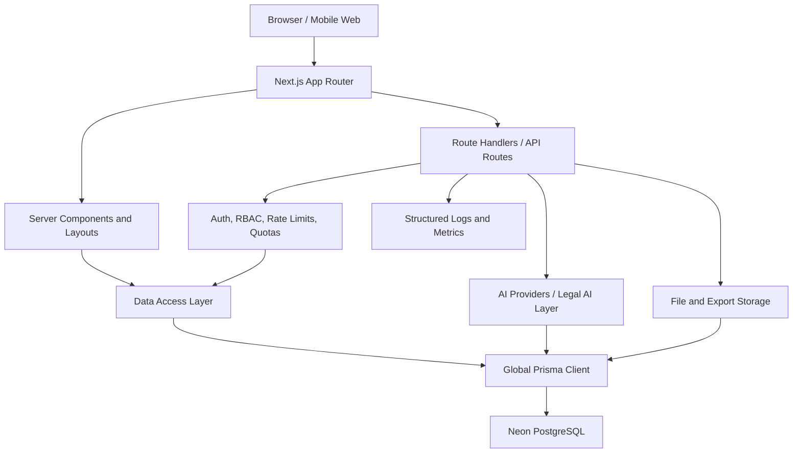
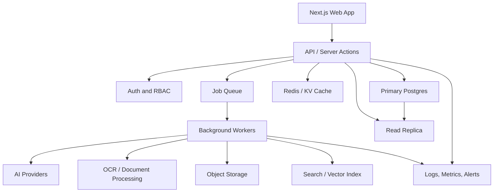

# MIZAN System Design and Scaling Guide

This document explains how MIZAN is designed today, which system design ideas are already used, how strong the current setup is, and how to scale it as data, users, documents, and AI usage grow.

It is written as a future upgrade guide for developers who need to keep the app reliable while moving from local development and early users toward serious production traffic.

## 1. System Overview

MIZAN is a case-first legal workflow platform built with:

- Next.js App Router for pages, layouts, server components, and API routes
- React client components for interactive workspaces
- Prisma ORM for typed database access
- PostgreSQL on Neon as the main system of record
- Custom authentication, sessions, roles, and profile tables
- AI workflows for case intake, chat, drafting, review, extraction, and action approval
- Structured observability logs for API requests, slow queries, queues, auth, and AI usage
- File/document workflows for uploads, extraction, exports, redaction, and evidence handling

The core design principle is simple:

> The `Case` record is the source of truth. Almost every important workflow attaches to a case, a document, a user, or a lawyer/client assignment.

## 2. High-Level Architecture



The app is currently a modular monolith. That is the right shape for this stage because the product is still changing quickly, but the internal boundaries are already useful:

- `src/app` owns routes, pages, and API handlers.
- `src/components` owns reusable UI and workspace components.
- `src/lib` owns auth, permissions, data access, Prisma, AI helpers, storage, observability, rate/usage logic, and RBAC.
- `prisma/schema.prisma` owns the data model.
- `prisma/migrations` owns database evolution.

## 3. Core Domain Model

The most important models are:

- `User`
- `ClientProfile`
- `LawyerProfile`
- `Case`
- `CaseAssignment`
- `ConsultationBooking`
- `Document`
- `EvidenceItem`
- `TimelineEvent`
- `Deadline`
- `Draft`
- `DraftVersion`
- `Comment`
- `InternalNote`
- `ActivityLog`
- `AssistantThread`
- `AssistantMessage`
- `AgentActionReview`
- `RiskScore`
- `ExportBundle`
- `RedactionJob`
- `DebateSession`
- `DebateTurn`

This model is strong because it is normalized around actual business objects instead of storing everything as unstructured JSON. That makes it easier to enforce access control, add indexes, paginate large sections, and keep audit trails.

## 4. System Design Concepts Already Used

### Case-Centric Data Ownership

Documents, evidence, timelines, deadlines, drafts, comments, activity logs, assistant threads, exports, risks, and debate sessions are tied back to a case.

Benefit:

- Easier authorization
- Easier delete/cascade cleanup
- Easier per-case dashboards
- Easier future billing and usage reporting

### Role-Based Access Control

The system separates:

- clients
- lawyers
- admins

Client and lawyer access is not meant to be interchangeable. A client can create and request legal help. A lawyer can accept/reject assigned requests and should only see full case details after the correct approval/proposal flow.

Benefit:

- Protects sensitive legal data
- Prevents API bypass
- Gives a clear path for future organization/team roles

### Layered Data Access

Reusable logic lives in `src/lib`, especially:

- `auth.ts`
- `permissions.ts`
- `rbac.ts`
- `data-access.ts`
- `pagination.ts`
- `prisma.ts`

Benefit:

- API routes do not need to duplicate every access rule.
- Expensive queries can be optimized once.
- Frontend pages can receive smaller, safer payloads.

### Global Prisma Singleton

The app uses a global Prisma client pattern in `src/lib/prisma.ts`.

Benefit:

- Prevents many Prisma clients during local hot reload
- Reduces connection pressure on Neon/Postgres
- Gives one place for slow query logging and transient read retry

### Connection Pool Awareness

The app expects pooled Neon connections for application traffic and can warn when pooling settings are missing.

Benefit:

- Helps avoid exhausting Postgres connections
- Makes serverless or multi-instance deployment safer

### Query Projection and Pagination

Many heavier pages use `select`, `take`, and split endpoints instead of fetching entire database objects.

Benefit:

- Smaller payloads
- Lower egress
- Lower memory usage
- Faster page rendering

### Lazy Loading of Heavy Case Sections

Documents, timeline, evidence, and activity can be loaded separately from the initial case detail payload.

Benefit:

- The first page render is not blocked by every large table.
- Future infinite scrolling is straightforward.

### Ordered Chat History

Assistant messages now use a per-thread `sequence` value instead of relying only on timestamps.

Benefit:

- Chat history stays in exact user/AI order after refresh.
- Same-timestamp messages are no longer randomly grouped.
- Concurrent assistant writes are safer.

### AI Quotas and Usage Visibility

The app includes AI usage counting and limits for free users.

Benefit:

- Prevents runaway AI cost
- Makes future paid plans easier
- Allows usage dashboards by user and feature

### Observability Hooks

The app already emits structured logs for:

- API request start/complete
- slow database queries
- Prisma warnings/errors
- queue/action events
- auth events
- usage and operational events

Benefit:

- Production issues can be diagnosed by request, route, feature, user, case, and duration.

### Cascading Deletes and Orphan Control

Important child records use relations tied to the owning case or parent object. Case deletion should remove owned case data and update AI workflow references so users do not open deleted cases.

Benefit:

- Reduces orphaned records
- Prevents broken "open case" links
- Keeps legal data lifecycle cleaner

## 5. Current Strength of the System

The current design is strong for:

- MVP and beta usage
- internal testing
- early client/lawyer onboarding
- thousands of users if traffic is moderate and queries stay paginated
- structured legal workflows where most data belongs to a case

The system is not yet fully hardened for:

- very large file processing volume
- long-running OCR/AI jobs inside request lifecycles
- massive real-time collaboration
- millions of assistant messages without archival strategy
- enterprise multi-tenant organizations
- strict high availability across regions
- very high write throughput

The current setup is a good modular monolith. It can scale further before needing microservices, but it needs stronger background processing, caching, storage, and read scaling as traffic grows.

## 6. Main Bottlenecks to Watch

### Database Round Trips

Symptoms:

- many `db.slow_query` logs
- repeated user/profile lookups
- repeated case access checks
- slow dashboards

Fixes:

- keep using `select`
- batch related reads with `Promise.all`
- avoid query loops
- use dedicated section endpoints
- use cursor pagination for large tables
- cache read-heavy dashboard summaries

### Prisma Connection Pressure

Symptoms:

- "Server has closed the connection"
- connection reset errors
- slow first query after idle
- many local HMR errors

Fixes:

- use a pooled Neon URL for `DATABASE_URL`
- keep `DIRECT_URL` only for migrations
- keep one global Prisma client
- avoid creating Prisma clients in scripts without disconnecting
- tune `connection_limit` and `pool_timeout`

### AI Request Cost and Latency

Symptoms:

- long waits on assistant responses
- expensive usage spikes
- users repeatedly retrying slow requests

Fixes:

- queue long AI workflows
- stream chat responses
- cache deterministic extraction results
- enforce per-user and per-feature quotas
- track AI cost by user, case, route, and feature

### File and Document Processing

Symptoms:

- uploads block requests
- OCR/extraction makes pages slow
- local storage becomes hard to move across deployments

Fixes:

- move files to object storage
- process extraction in background jobs
- store extracted text separately from list views
- keep document metadata small
- add virus scanning and file validation pipeline

### Large Case Workspaces

Symptoms:

- one case page becomes slow after many documents/messages/logs
- activity and timeline tables grow quickly
- dashboard summaries become expensive

Fixes:

- cursor pagination
- archive old activity logs
- load only first-page summaries
- use materialized summary tables for counts
- partition very large time-series tables later

## 7. Scaling With the Current Setup

The current setup can scale further without a full rewrite if the following rules are followed.

### Keep the App as a Modular Monolith First

Do not split into services too early. Instead:

- keep domain logic in `src/lib`
- keep API handlers thin
- keep Prisma access centralized
- keep auth/RBAC reusable
- keep long jobs outside request/response when needed

This preserves development speed while still allowing future extraction of heavy subsystems.

### Use Neon Properly

Use two connection strings:

```env
DATABASE_URL="pooled Neon connection for app traffic"
DIRECT_URL="direct Neon connection for migrations and maintenance"
```

Recommended production posture:

- pooled app traffic
- direct migration traffic
- autoscaling enabled on Neon compute
- database branch for preview/testing
- regular backups and restore drills
- slow query monitoring
- read replica once reporting/dashboard reads become heavy

### Keep Queries Small

Every production query should answer:

- Which fields are actually needed?
- Is there a `take` limit?
- Is the filter indexed?
- Is this query repeated in the same request?
- Could this become a cursor-paginated endpoint?

Avoid:

- loading `extractedText` in list views
- loading all messages for all threads
- returning whole case trees from one endpoint
- counting large tables on every request
- querying inside loops

### Prefer Cursor Pagination for Growing Tables

Use cursor pagination for:

- `ActivityLog`
- `AssistantMessage`
- `TimelineEvent`
- `Document`
- `EvidenceItem`
- `DraftVersion`
- `Notification`

Offset pagination is acceptable for small lists. Cursor pagination is safer when tables become large.

### Split Expensive Workflows

Keep quick validation in API routes. Move slow work to background jobs:

- OCR
- PDF parsing
- document classification
- AI summarization
- bulk export generation
- email sending
- notification fanout
- large search indexing

## 8. Future Upgrade Roadmap

### Phase 1: Production Hardening

Goal: make current monolith reliable.

Add or verify:

- centralized error tracking
- request IDs everywhere
- structured logs with user/case/route/feature fields
- uptime checks
- slow query dashboard
- AI cost dashboard
- upload failure dashboard
- backup and restore runbook
- migration runbook
- rate limits for auth, AI, uploads, search, and exports
- security review for all protected APIs

### Phase 2: Background Jobs

Goal: stop long-running work from blocking user requests.

Add a queue system such as:

- BullMQ with Redis
- Inngest
- Trigger.dev
- Vercel Queue style workflow
- managed cloud task queue

Move these jobs:

- document extraction
- AI evidence classification
- OCR
- draft generation
- export bundle generation
- notification fanout
- large search indexing

Required job concepts:

- idempotency key
- retry policy
- dead-letter queue
- job status table
- queue latency metric
- per-user and per-case job limits

### Phase 3: Object Storage

Goal: make uploads portable and scalable.

Move from local/generated files to object storage:

- S3
- Cloudflare R2
- Azure Blob
- Google Cloud Storage
- Cloudinary for media-heavy assets

Store in Postgres:

- storage key
- bucket
- size
- MIME type
- hash
- scan status
- owner/user/case/document relation

Do not store large binary files in Postgres.

### Phase 4: Search Infrastructure

Goal: make investigation/search fast on large data.

Options:

- Postgres full-text search for first stage
- pgvector for embeddings
- Meilisearch for fast app search
- OpenSearch/Elasticsearch for large indexing
- hybrid: Postgres metadata filters + vector/full-text index

Index:

- document title/file name
- AI summary
- extracted text chunks
- evidence labels
- timeline descriptions
- comments
- draft titles

Keep search results permission-filtered by case access.

### Phase 5: Read Scaling and Caching

Goal: reduce pressure on primary database.

Add:

- read replica for reporting and dashboards
- Redis/Vercel KV for small hot data
- per-user dashboard summary cache
- per-case count summary table
- invalidation on writes

Good cache candidates:

- navigation counts
- notification count
- dashboard cards
- lawyer profile directory filters
- static legal reference content
- AI usage summary for current period

Avoid caching:

- sensitive case details without strict user-specific keys
- permission decisions without short TTL
- data that changes during approval/payment workflows unless invalidation is reliable

### Phase 6: Multi-Tenancy and Organizations

Goal: support firms, teams, and enterprise accounts.

Add:

- `Organization`
- `OrganizationMembership`
- org-level roles
- firm-level lawyer teams
- case sharing rules
- billing account per organization
- audit logs by organization

Use tenant-aware access checks:

- user owns the record
- user belongs to org
- org has accepted case assignment
- user has permission inside org

### Phase 7: Partitioning and Archival

Goal: handle very large tables.

Consider partitioning or archival for:

- `ActivityLog`
- `AssistantMessage`
- `Notification`
- `DraftVersion`
- raw extracted text chunks

Strategies:

- archive old activity logs by month
- move old assistant messages to cold storage
- keep only summaries in hot tables
- partition by time when write volume is high
- export old case packets before cold archival

### Phase 8: Service Extraction

Goal: split only when the monolith becomes a clear bottleneck.

Possible future services:

- document processing service
- AI workflow service
- notification service
- search indexing service
- export generation service
- billing service

Keep these services connected by events, queues, and stable IDs. Do not let each service invent separate user/case identity rules.

## 9. Handling More Data

### Documents

For 10x more documents:

- enforce file size/type limits
- store files in object storage
- process extraction in queue
- store metadata separately from extracted text
- chunk extracted text for search/AI
- do not load extracted text in normal document lists

### Assistant Messages

For 10x more chat history:

- keep `threadId, sequence` index
- load latest messages with cursor pagination
- summarize old conversations
- archive old messages after a retention period
- keep thread-level summary for fast context building

### Activity Logs

For 10x more activity:

- write logs asynchronously where possible
- use cursor pagination
- create daily/monthly partitions when needed
- keep dashboard summaries separate from raw logs

### Timelines and Evidence

For 10x more case events:

- keep indexed `caseId` plus date/order fields
- paginate by date/cursor
- group events by month in UI
- use background jobs for automatic extraction

### Draft Versions

For 10x more drafts:

- store diff/summary where possible
- limit loaded versions per draft
- archive old versions
- avoid loading full draft bodies in lists

## 10. Handling More Users

### Auth and Sessions

Scale plan:

- keep session lookup lean
- index session token fields
- rotate/revoke sessions safely
- avoid loading full profiles on every layout when not needed
- add login abuse protection

### Dashboards

Scale plan:

- stop calculating everything live
- precompute dashboard summaries
- cache per-user dashboard data
- update summaries on writes or background intervals

### Lawyer Directory

Scale plan:

- paginate directory pages
- index city, specialties, rating, public status
- add search infrastructure if profiles grow large
- cache public profile pages

### Notifications

Scale plan:

- batch notification writes
- unread count cache
- background delivery for email/push
- cursor pagination for notification history

### AI

Scale plan:

- quota by user, case, and feature
- stream responses
- queue expensive workflows
- cache extraction outputs
- track provider latency and cost
- support fallback providers

## 11. Database Indexing Strategy

Current important index patterns should be preserved:

- owner/access fields: `userId`, `clientProfileId`, `lawyerProfileId`
- case ownership fields: `caseId`
- document ownership fields: `documentId`
- ordered list fields: `createdAt`, `updatedAt`, `eventDate`, `dueDate`
- workflow state fields: `status`, `proposalStatus`, `verificationStatus`
- assistant ordering: `threadId, sequence`

Index design rule:

> Any field repeatedly used in `WHERE`, `ORDER BY`, or join relations should be considered for an index, but every new index also adds write overhead.

Before adding indexes:

1. Confirm the query is frequent or slow.
2. Check the exact `WHERE` and `ORDER BY`.
3. Add a compound index matching the access pattern.
4. Verify with `EXPLAIN ANALYZE`.
5. Remove duplicate or unused indexes later.

## 12. Observability Needed for Scale

The system should keep improving these dashboards:

- per-route latency
- per-route error rate
- slow database queries
- query count per request
- Prisma connection errors
- queue depth and queue age
- AI token usage by user/case/feature
- AI cost by provider/model/route
- upload failures
- document processing failures
- export failures
- auth failures
- rate limit violations

Recommended log fields:

- `requestId`
- `route`
- `method`
- `userId`
- `role`
- `caseId`
- `documentId`
- `feature`
- `durationMs`
- `status`
- `errorCode`

## 13. Reliability Runbooks

### If Database Gets Slow

1. Check slow query logs.
2. Identify repeated queries, not only single slow queries.
3. Check whether the route does too many independent requests.
4. Verify indexes match `WHERE` and `ORDER BY`.
5. Reduce selected fields.
6. Add pagination.
7. Cache dashboard/count data.
8. Consider read replica for reporting.

### If Neon Connections Fail

1. Confirm app uses pooled `DATABASE_URL`.
2. Confirm migrations use `DIRECT_URL`.
3. Check connection limit and pool timeout.
4. Check for accidental new Prisma clients.
5. Restart app server if local HMR leaves stale connections.
6. Review Neon compute status, cold starts, and region latency.

### If AI Cost Spikes

1. Check AI usage dashboard.
2. Identify user/case/feature causing spike.
3. Tighten quotas.
4. Add queue/backoff.
5. Cache extraction outputs.
6. Reduce context size.
7. Summarize old chat history.

### If Uploads Fail

1. Check file size/type enforcement.
2. Check storage provider health.
3. Check extraction queue.
4. Retry idempotently.
5. Mark document processing status clearly for users.

## 14. Future Architecture Target

The long-term architecture can remain case-centric while adding dedicated infrastructure:



## 15. Practical Scaling Checklist

Before adding many more users:

- [ ] Confirm all app traffic uses pooled `DATABASE_URL`.
- [ ] Confirm Prisma singleton is used everywhere.
- [ ] Add queue for long AI/document jobs.
- [ ] Move uploaded/generated files to object storage.
- [ ] Add dashboards for route latency, DB slow queries, AI usage, and queue depth.
- [ ] Add cursor pagination to long lists.
- [ ] Add read replica for reporting if dashboards become heavy.
- [ ] Add per-case and per-user summary tables for expensive counts.
- [ ] Add stronger alerting for failed exports/uploads/OCR.
- [ ] Load test the top user flows.

Before handling very large data:

- [ ] Chunk extracted text.
- [ ] Add search index.
- [ ] Archive old messages/logs.
- [ ] Partition activity/message tables if needed.
- [ ] Keep legal/audit retention rules documented.

Before enterprise/firms:

- [ ] Add organizations and memberships.
- [ ] Add org-level roles and audit logs.
- [ ] Add billing ownership by organization.
- [ ] Add firm-level case assignment rules.
- [ ] Add data export and deletion policy.

## 16. Final Assessment

MIZAN is currently designed with a good foundation:

- strong case-centric schema
- clear client/lawyer split
- typed Prisma data access
- structured AI workflows
- useful observability hooks
- query optimization already started
- rate/usage controls started
- migration-based database evolution

The next major scaling step is not a rewrite. The next step is operational hardening:

- queues
- object storage
- better dashboards
- cursor pagination everywhere large
- caching for summaries
- search infrastructure
- read replica when read-heavy

With those upgrades, the current architecture can continue to scale while staying understandable and maintainable.
