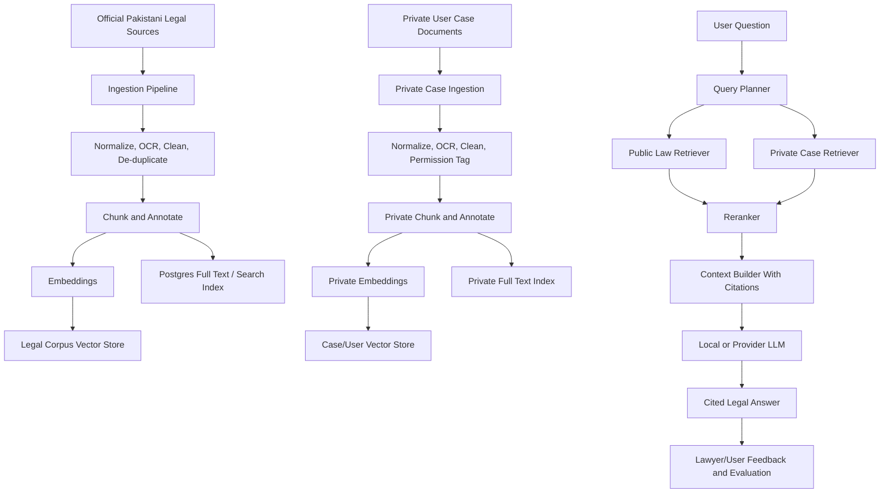

# MIZAN Roadmap To A Pakistani Legal RAG System

This document explains how MIZAN can move from provider-only AI responses toward a proper Retrieval-Augmented Generation system grounded in real Pakistani legal data.

The goal is not just to "ask Gemini better prompts." The goal is to build MIZAN's own legal knowledge layer:

- official Pakistani laws
- federal and provincial legislation
- reported and unreported judgments
- rules, notifications, circulars, forms, and practice directions
- legal concepts mapped to Pakistani procedure
- private case documents and evidence, safely separated per user/case
- citations and source-backed answers
- local or self-hosted models where possible
- measurable quality through evaluations and lawyer feedback

## 1. Why MIZAN Needs RAG

Today MIZAN already has useful AI behavior:

- `src/lib/legal-ai.ts` builds prompts for legal answers, documents, drafts, summaries, and context-aware responses.
- `src/lib/ai/index.ts` routes prompts to Gemini, OpenAI, or mock providers.
- `src/lib/ai/agent-runner.ts` lets the assistant decide when to answer, ask follow-up questions, or propose tool actions.
- `src/lib/pakistan-law/retrieval.ts` retrieves from a small local Pakistan-law starter pack.
- Case workspaces already provide private case context from documents, evidence, timeline, deadlines, drafts, and risk scores.

That is a good start, but it is not enough for a serious legal system.

The current weakness:

- The legal knowledge pack is small.
- Retrieval is keyword-based.
- Answers still rely heavily on provider model memory.
- There is no large citation-grounded Pakistani legal corpus.
- There is no systematic evaluation of legal accuracy.
- There is no clear separation between public legal knowledge, private user case data, and training data.

RAG fixes the foundation by making the model retrieve trusted context before answering.

## 2. Important Distinction: RAG Is Not Training

RAG means:

1. Store trusted legal documents.
2. Break them into searchable chunks.
3. Retrieve the most relevant chunks for each question.
4. Give those chunks to the model.
5. Force the answer to cite those chunks.

Training or fine-tuning means:

1. Update model behavior or weights.
2. Teach style, reasoning format, citation discipline, tool selection, and domain behavior.
3. Usually requires carefully reviewed examples and evaluations.

MIZAN should do RAG first, then fine-tuning later.

Reason:

- RAG gives traceable citations.
- RAG can be updated when Pakistani law changes.
- RAG can separate public law from private case data.
- RAG reduces hallucination without needing to train a model from scratch.
- Fine-tuning without a strong retrieval corpus can make the model sound confident while still being wrong.

## 3. Target Architecture



## 4. Official Pakistani Data Sources To Prioritize

Use official sources first. Do not scrape or ingest copyrighted databases without permission. Keep source URL, crawl date, document version, and license/usage notes for every record.

### Federal Laws

- Pakistan Code, Ministry of Law and Justice: https://pakistancode.gov.pk/english/index.php
- Ministry of Law and Justice: https://www.molaw.gov.pk/

Use for:

- Constitution
- federal acts
- ordinances
- core statutes such as PPC, CrPC, CPC, QSO, Contract Act, Specific Relief Act, limitation laws, family laws, tenancy-related federal laws where applicable

### Provincial Laws

- Punjab Laws Online: https://punjablaws.gov.pk/
- Sindh Code: https://sindhlaws.gov.pk/SindhIndex.aspx
- Khyber Pakhtunkhwa official portal / KP Code: https://www.kp.gov.pk/ and https://kpcode.kp.gov.pk/
- Balochistan official law downloads: https://balochistan.gov.pk/law-and-parliamentary-affairs-department-downloads/

Use for:

- rent laws
- local government laws
- consumer laws
- provincial criminal/procedural amendments
- revenue laws
- family/custody implementation rules where provincial
- service tribunal and departmental rules

### Superior Court Judgments

- Supreme Court of Pakistan judgment search: https://scp.gov.pk/JudgmentsSearch
- Lahore High Court: https://www.lhc.gov.pk/
- Lahore High Court reported judgments: https://data.lhc.gov.pk/reported_judgments/judgments_approved_for_reporting
- Islamabad High Court case law/judgments: https://mis.ihc.gov.pk/frmJgmnt?jgs=1
- Sindh High Court: https://sindhhighcourt.gov.pk/
- Balochistan High Court judgments: https://bhc.gov.pk/index.php?params=resources%2Fjudgments
- Peshawar High Court: https://www.peshawarhighcourt.gov.pk/

Use for:

- binding and persuasive case law
- interpretation of statutes
- procedural principles
- constitutional rights
- bail, tenancy, family, service, tax, contract, property, criminal, and civil practice areas

### Legal Reform, Statistics, and Reference Material

- Law and Justice Commission of Pakistan: https://ljcp.gov.pk/

Use for:

- legal reform reports
- justice-sector statistics
- policy context
- structural legal-system information

## 5. Data Governance Rules

Before building a big corpus, define these rules.

### Source Trust Levels

Every source should have a trust level:

- `OFFICIAL_PRIMARY`: official statute, gazette, court judgment, official court PDF
- `OFFICIAL_SECONDARY`: government report, commission report, court rules page
- `LICENSED_SECONDARY`: licensed law report, journal, commentary
- `INTERNAL_VERIFIED`: lawyer-reviewed MIZAN note or template
- `USER_PRIVATE`: client/lawyer uploaded document
- `UNVERIFIED_WEB`: not allowed for legal answers unless explicitly marked as weak context

### Public vs Private Data

Never mix these:

- public legal corpus
- MIZAN internal verified templates
- user private case files
- lawyer internal notes
- training/evaluation examples

Private case documents can be used for that case's answer, but they should not be used to train the public model unless explicitly anonymized, consented, and legally reviewed.

### Versioning

Pakistani law changes. RAG must know document versions.

Track:

- source URL
- source type
- jurisdiction
- court
- statute title
- section/article/order/rule
- judgment date
- bench
- citation
- neutral citation where available
- crawl date
- text hash
- version number
- superseded/repealed status
- effective date

## 6. Proposed Database Tables

Start in Postgres. Add pgvector later if using Postgres for vectors.

### LegalSource

Stores source systems.

Fields:

- `id`
- `name`
- `baseUrl`
- `sourceType`
- `trustLevel`
- `jurisdiction`
- `licenseNotes`
- `crawlPolicy`
- `createdAt`
- `updatedAt`

### LegalDocument

Stores each law, judgment, rule, PDF, form, notification, or verified internal legal note.

Fields:

- `id`
- `sourceId`
- `title`
- `documentType`
- `jurisdiction`
- `court`
- `citation`
- `neutralCitation`
- `dateIssued`
- `effectiveDate`
- `url`
- `filePath`
- `language`
- `textHash`
- `status`
- `metadata`
- `createdAt`
- `updatedAt`

### LegalChunk

Stores searchable passages.

Fields:

- `id`
- `documentId`
- `chunkIndex`
- `heading`
- `sectionRef`
- `pageNumber`
- `text`
- `tokens`
- `language`
- `metadata`
- `createdAt`

### LegalEmbedding

Stores vector embeddings.

Fields:

- `id`
- `chunkId`
- `embeddingModel`
- `embedding`
- `dimension`
- `createdAt`

If using pgvector, `embedding` becomes a vector column. If using Qdrant/Milvus/Weaviate, store the external vector ID instead.

### LegalCitation

Stores citation relationships.

Fields:

- `id`
- `fromDocumentId`
- `toDocumentId`
- `citationText`
- `relationshipType`
- `createdAt`

Relationship examples:

- cites
- overrules
- follows
- distinguishes
- interprets
- refers_to_section

### RetrievalRun

Stores retrieval audit data.

Fields:

- `id`
- `userId`
- `caseId`
- `question`
- `retrieverVersion`
- `topK`
- `filters`
- `latencyMs`
- `createdAt`

### RetrievalResult

Stores what was retrieved.

Fields:

- `id`
- `retrievalRunId`
- `chunkId`
- `rank`
- `score`
- `rerankScore`
- `usedInAnswer`

### RagEvaluation

Stores quality checks.

Fields:

- `id`
- `question`
- `expectedSources`
- `expectedAnswerNotes`
- `answer`
- `faithfulnessScore`
- `citationScore`
- `lawyerReviewed`
- `reviewNotes`
- `createdAt`

## 7. Retrieval Strategy

MIZAN should not use vector search alone.

Use hybrid retrieval:

1. metadata filters
2. full-text search
3. vector search
4. citation graph expansion
5. reranking
6. context compression

### Metadata Filters

Filter by:

- jurisdiction: Pakistan, Punjab, Sindh, KP, Balochistan, Islamabad
- court: Supreme Court, High Court, tribunal
- topic: family, rent, contract, property, criminal, service, tax, consumer
- document type: statute, judgment, rule, form, notification
- date
- source trust level

### Full-Text Search

Good for:

- section numbers
- exact phrases
- case names
- legal terms
- citations

Example:

- "section 489-F"
- "Order XXXIX Rule 1"
- "Article 199"
- "specific performance"

### Vector Search

Good for:

- natural language questions
- Urdu/Roman Urdu queries
- concept matching
- evidence-to-law matching

Example:

- "my landlord is refusing to return security deposit"
- "police are not registering FIR"
- "employer has not paid salary"

### Reranking

After retrieving 30 to 80 chunks, rerank to the top 5 to 12 chunks.

Recommended reranker families:

- BGE rerankers
- Jina rerankers
- Cohere rerankers if using managed API
- later, a MIZAN-trained legal reranker

### Context Builder

The context builder should produce:

- short source title
- document type
- jurisdiction
- citation or section reference
- source URL
- passage text
- confidence/trust label

The model should never receive raw chunks without citation metadata.

## 8. Recommended Models

The goal is to reduce dependency on paid API keys over time. That does not mean the first RAG version must be fully self-hosted. Move in stages.

### Embedding Models

For Pakistani legal RAG, embeddings must handle English, Urdu, and Roman Urdu.

Good candidates:

- BAAI/bge-m3
- intfloat/multilingual-e5-large
- jina-embeddings-v3
- sentence-transformers multilingual models

Start with a multilingual embedding model, then evaluate on Pakistani legal queries.

### Generator Models

For local/self-hosted generation:

- Llama family
- Qwen family
- Mistral family
- DeepSeek family
- other strong open-weight instruction models

Serving options:

- vLLM for production GPU serving
- Text Generation Inference
- Ollama for local development
- LM Studio for local experiments

### Reranker Models

Use a reranker when quality matters.

Options:

- bge-reranker-v2-m3
- jina-reranker family
- custom legal reranker later

### Fine-Tuned MIZAN Legal Model

Only after RAG and evaluation exist:

- train LoRA/adapters for legal answer style
- train tool-selection behavior
- train citation discipline
- train refusal/uncertainty behavior
- train Urdu/Roman Urdu legal explanation style

Do not train from scratch unless there is a major budget and ML team. Fine-tuning a strong open model is the realistic path.

## 9. How To Integrate With Current MIZAN Code

### Current Seam

Current file:

- `src/lib/pakistan-law/retrieval.ts`

Current function:

- `buildPakistanLawContext(query)`

Future replacement:

- `src/lib/rag/retriever.ts`
- `buildLegalRagContext(query, options)`

The function should return the same kind of usable context, but with real citations.

Proposed return shape:

```ts
type LegalRagContext = {
  context: string;
  citations: Array<{
    chunkId: string;
    documentId: string;
    title: string;
    sourceUrl?: string;
    citation?: string;
    sectionRef?: string;
    jurisdiction?: string;
    trustLevel: string;
    score: number;
  }>;
  retrievalRunId: string;
};
```

### `legal-ai.ts`

Current role:

- Builds case context.
- Builds document context.
- Adds Pakistan-law starter context.
- Calls `runAiTask`.

Future role:

- Retrieve public Pakistani law context.
- Retrieve private case/document context.
- Merge both into a cited answer context.
- Tell the model to answer only from retrieved sources where legal precision matters.
- Return citations to the UI.

Change concept:

```ts
const lawContext = await buildLegalRagContext(question, {
  jurisdictionHints,
  caseCategory,
  language,
  userId,
  caseId
});
```

### `agent-runner.ts`

Current role:

- Decides whether to answer, ask follow-up, or call a tool.
- Uses current user, question, case/document context, recent messages.

Future role:

- Retrieve law before deciding on legal action.
- Retrieve case-private facts before generating case actions.
- Keep mutation tools behind approval.
- Attach citations to proposals.

Important:

RAG should inform tools, not bypass approvals.

Example:

- User asks: "Can I file a rent case?"
- RAG retrieves relevant rent law and judgments.
- Agent answers and may propose "create case" or "prepare notice."
- User still approves before the case/draft is saved.

### AI Action Review System

Current files:

- `src/lib/agent-action-reviews.ts`
- `src/app/api/ai/actions/[id]/route.ts`

Future integration:

- Save retrieved citations with each proposed action.
- Show "This action is based on these sources."
- Require stronger confirmation for low-confidence or missing-citation actions.

### Case Workspace

Current case data:

- documents
- evidence
- timeline
- deadlines
- drafts
- comments
- internal notes
- activity logs
- assistant threads

Future RAG behavior:

- public law corpus retrieval
- private case document retrieval
- private evidence retrieval
- private timeline retrieval
- combine public law + private facts

Never put private user chunks in the public legal vector index.

### Document Pipeline

Current document behavior:

- upload
- extraction
- AI summary
- evidence/timeline/deadline extraction

Future RAG behavior:

- every uploaded document creates private chunks
- chunks are embedded with case/user metadata
- user can ask questions over their own documents
- lawyer can only retrieve private chunks after access is approved

### Search / Investigation Tab

Future RAG behavior:

- turn search into hybrid search
- exact search for names, CNIC, FIR, sections, citations
- vector search for meaning
- filters for case, date, document type, source, jurisdiction
- source preview with highlighted chunks

### AI Usage Page

Future behavior:

- show chats used
- show tokens used
- show retrieval calls
- show local GPU compute minutes if self-hosted
- show document indexing usage
- show storage usage
- show plan limits

## 10. Provider Strategy: From Gemini To MIZAN AI

### Stage 0: Current Setup

Current:

- Gemini/OpenAI/mock provider
- small local Pakistan law JSON
- case context from database

This is good for prototyping.

### Stage 1: Provider Model + Real RAG

Keep Gemini/OpenAI temporarily, but stop depending on model memory.

The model receives:

- retrieved Pakistani law chunks
- citations
- private case context
- answer format rules

This immediately improves reliability.

### Stage 2: Local Embeddings + Provider Model

Use local embeddings for indexing and retrieval.

Benefits:

- no embedding API cost
- private data stays under our control
- predictable indexing cost

### Stage 3: Local Reranker

Add local reranking.

Benefits:

- better citations
- fewer irrelevant chunks
- less prompt bloat

### Stage 4: Local Generator

Serve an open-weight LLM with vLLM/TGI/Ollama.

Benefits:

- no dependency on Gemini/OpenAI keys for basic answers
- lower marginal cost at scale if GPU is utilized well
- more control over privacy and latency

Tradeoff:

- GPU hosting and model operations are serious work.
- Quality must be measured against provider baselines.

### Stage 5: Fine-Tuned MIZAN Model

Fine-tune for:

- Pakistani legal answer style
- citation discipline
- refusal when sources are weak
- Urdu/Roman Urdu simplification
- agent tool selection
- drafting formats

Do not fine-tune on private user documents unless there is consent, anonymization, and legal review.

## 11. RAG Quality Requirements

A legal answer should not just sound good. It must be grounded.

Every serious legal answer should include:

- relevant statute or section where available
- relevant judgment if applicable
- jurisdiction
- uncertainty warning when sources are weak
- clear next steps
- evidence gaps
- lawyer review warning for high-risk matters

The answer should avoid:

- fake case citations
- fake sections
- overconfident legal conclusions
- mixing Indian law with Pakistani law unless explicitly relevant as comparative material
- treating provincial law as national law

## 12. Evaluation System

Build an evaluation set before trusting the RAG system.

### Evaluation Categories

- rent/security deposit
- family law
- consumer/refund
- employment/salary
- contract breach
- property dispute
- FIR/police refusal
- cheque dishonour
- bail/criminal procedure
- constitutional petition
- limitation/deadlines
- evidence/document admissibility

### Metrics

- retrieval hit rate
- citation precision
- citation recall
- answer faithfulness
- hallucination rate
- jurisdiction correctness
- section/citation correctness
- lawyer approval rate
- user helpfulness rating
- latency
- cost per answer

### Golden Dataset

Each test item should have:

- question
- jurisdiction
- expected source documents
- expected legal principles
- unacceptable mistakes
- ideal answer notes
- lawyer reviewer

## 13. Training Plan

### Step 1: Collect Data

Collect:

- statutes
- judgments
- rules
- forms
- verified templates
- anonymized Q&A examples
- lawyer-reviewed answer corrections
- tool-action examples

### Step 2: Clean Data

Clean:

- OCR errors
- broken page headers/footers
- repeated watermarks
- duplicate judgments
- outdated/repealed laws
- mixed jurisdiction labels

### Step 3: Label Data

Label:

- topic
- jurisdiction
- document type
- court
- date
- sections
- citations
- procedural posture
- outcome
- legal principle

### Step 4: Train Retrieval First

Improve:

- chunking
- embeddings
- metadata filters
- reranking
- citation extraction

### Step 5: Fine-Tune Behavior

Fine-tune only after retrieval works.

Train:

- answer style
- "I do not know from the provided sources"
- citation formatting
- Urdu/Roman Urdu explanations
- safe legal caution
- agent action planning

### Step 6: Human Review Loop

Lawyers should review:

- bad answers
- low-confidence answers
- missing citations
- new high-value workflows
- generated templates

Store reviewer feedback for future fine-tuning.

## 14. Chunking Strategy

Different legal documents need different chunking.

### Statutes

Chunk by:

- act
- chapter
- section
- subsection
- explanation/illustration

Keep section references intact.

### Judgments

Chunk by:

- facts
- issues
- arguments
- reasoning
- holding/order
- cited cases

Add metadata:

- court
- bench
- date
- citation
- topic
- result

### Rules and Notifications

Chunk by:

- rule number
- schedule
- form
- circular paragraph

### Private Case Documents

Chunk by:

- page
- heading
- paragraph
- extracted entity
- document type

Keep original page references for evidence.

## 15. Citation Format

Every answer should be able to show:

```text
Source:
- Title: ...
- Type: statute/judgment/rule/document
- Jurisdiction: ...
- Citation/section: ...
- Court/date: ...
- URL/file: ...
- Retrieved passage: ...
```

UI should show citations as expandable source cards.

For private case documents:

```text
Source:
- Case document: Rent Agreement.pdf
- Page: 2
- Uploaded by: client/lawyer
- Access: private case record
```

## 16. Security And Privacy

### Public Legal Corpus

Can be shared across users.

### Private Case Corpus

Must be filtered by:

- `userId`
- `caseId`
- `documentId`
- `clientProfileId`
- `lawyerProfileId`
- assignment/proposal/access status

### Lawyer Internal Notes

Never retrieve for clients.

### Deleted Cases

When a case is deleted:

- delete private chunks
- delete private embeddings
- delete retrieval references
- mark old AI workflow links as deleted
- remove search index records

### Training Data

Do not train on private documents unless:

- user consent exists
- lawyer/client confidentiality is respected
- data is anonymized
- retention policy allows it
- legal review approves it

## 17. Suggested Folder Structure

```text
src/lib/rag/
  ingest/
    sources.ts
    crawler.ts
    pdf-loader.ts
    ocr.ts
    normalize.ts
    dedupe.ts
  chunking/
    statute-chunker.ts
    judgment-chunker.ts
    private-document-chunker.ts
  embeddings/
    index.ts
    local-embeddings.ts
    provider-embeddings.ts
  retrieval/
    hybrid-retriever.ts
    reranker.ts
    context-builder.ts
  citations/
    citation-parser.ts
    citation-graph.ts
  evaluation/
    eval-runner.ts
    datasets.ts
  types.ts
```

## 18. Environment Variables

Future variables:

```env
RAG_ENABLED="true"
RAG_VECTOR_BACKEND="pgvector"
RAG_EMBEDDING_PROVIDER="local"
RAG_EMBEDDING_MODEL="BAAI/bge-m3"
RAG_RERANKER_PROVIDER="local"
RAG_RERANKER_MODEL="BAAI/bge-reranker-v2-m3"
RAG_GENERATOR_PROVIDER="local"
RAG_LOCAL_LLM_BASE_URL="http://localhost:8000/v1"
RAG_LOCAL_LLM_MODEL="qwen-or-llama-legal"
RAG_TOP_K="40"
RAG_RERANK_TOP_K="8"
RAG_REQUIRE_CITATIONS="true"
```

Keep existing provider keys as fallback during migration:

```env
AI_PROVIDER="gemini"
GEMINI_API_KEY=""
OPENAI_API_KEY=""
```

Long-term:

```env
AI_PROVIDER="local-rag"
```

## 19. Implementation Phases

### Phase 1: Real Corpus Schema

Add:

- `LegalSource`
- `LegalDocument`
- `LegalChunk`
- `LegalCitation`
- retrieval audit tables

Keep current JSON starter pack as seed data.

### Phase 2: Ingestion Pipeline

Add jobs for:

- official law ingestion
- judgment ingestion
- PDF download
- OCR
- text normalization
- dedupe
- chunking
- metadata extraction

Do this in background jobs, not inside request handlers.

### Phase 3: Hybrid Search

Start with:

- Postgres full-text search
- pgvector or external vector DB
- metadata filtering

Replace `buildPakistanLawContext` with `buildLegalRagContext`.

### Phase 4: Case-Private RAG

Index uploaded case documents.

Add retrieval modes:

- public law only
- private case only
- public law + private case

Enforce permissions at retrieval time.

### Phase 5: Citation UI

Update AI answer UI:

- source cards
- cited passages
- confidence
- source type
- official/private label
- "open document" for private case docs

### Phase 6: Evaluation Harness

Add:

- golden questions
- expected citations
- lawyer review fields
- nightly evaluation
- regression reports

No model should be trusted without evaluation.

### Phase 7: Local Model Serving

Add local LLM provider adapter:

- vLLM or TGI in production
- Ollama for local development
- OpenAI-compatible HTTP interface if possible

The existing `runAiTask` provider pattern can support this cleanly.

### Phase 8: Fine-Tuning

Fine-tune only after:

- retrieval quality is measured
- citation quality is measured
- lawyer feedback exists
- prompt formats stabilize

## 20. How Each Existing Tool Improves With RAG

### AI Legal Assistant

Before:

- prompt + provider memory + small local law pack

After:

- public law retrieval
- private case retrieval
- citations
- confidence
- answer audit trail

### AI Workflows

Before:

- agent proposes actions based on prompt and case context

After:

- agent proposes actions with legal sources attached
- risky action proposals require stronger confirmation
- action review can show "why this action was suggested"

### Case Creation

Before:

- turns user story into structured case

After:

- maps story to likely legal categories using retrieved statutes and examples
- suggests missing evidence based on similar legal patterns

### Document Analysis

Before:

- summarizes extracted text

After:

- maps clauses, notices, FIRs, rent agreements, receipts, and letters to relevant Pakistani law
- cites source sections and judgments

### Evidence Analysis

Before:

- labels evidence and strength

After:

- ranks evidence against required legal ingredients
- explains missing proof with citations

### Timeline and Deadlines

Before:

- detects dates and deadlines

After:

- connects dates to limitation rules, notice periods, appeal windows, and procedure

### Draft Generation

Before:

- generates draft from prompt/case context

After:

- drafts based on retrieved law, templates, and jurisdiction-specific requirements
- includes source-backed drafting notes

### Lawyer Handoff Packets

Before:

- summarizes case for lawyer

After:

- includes legal issue map, cited authorities, evidence gaps, and questions for counsel

### Search Investigation

Before:

- app search and filters

After:

- hybrid legal and case search
- exact citation lookup
- semantic concept search
- source cards and ranked passages

### Debate Mode

Before:

- model simulates opposing counsel

After:

- each side must cite retrieved law
- evaluation checks source support
- debate quality improves dramatically

## 21. What Not To Do

Do not:

- scrape copyrighted law databases without permission
- mix Indian law into Pakistani answers accidentally
- train on private client data by default
- depend only on vector similarity
- trust answers without citations
- let local LLM confidence replace legal review
- build microservices before the RAG pipeline is stable
- fine-tune before evaluation exists
- store large PDFs or binary data directly in Postgres
- retrieve lawyer internal notes for clients

## 22. Success Criteria

The RAG system is working when:

- answers cite real Pakistani legal sources
- citations open to source documents
- source passages support the answer
- private case facts remain private
- lawyer reviewers can approve/correct answers
- retrieval quality is measured
- AI cost is lower or more predictable
- local model fallback works
- legal updates can be re-indexed without retraining
- users can trust where the answer came from

## 23. Final Target

The long-term goal is:

> MIZAN should become a Pakistani legal intelligence layer where AI answers are not based on generic model memory, but on a continuously updated, source-cited, permission-aware legal corpus plus each user's private case record.

Gemini/OpenAI can remain optional providers, but they should not be the legal source of truth.

The source of truth should be:

- official Pakistani law
- court judgments
- verified legal templates
- lawyer-reviewed corrections
- private case evidence where the user has access
- measurable retrieval and evaluation results

That is the path from "AI assistant" to a real legal operating system.
